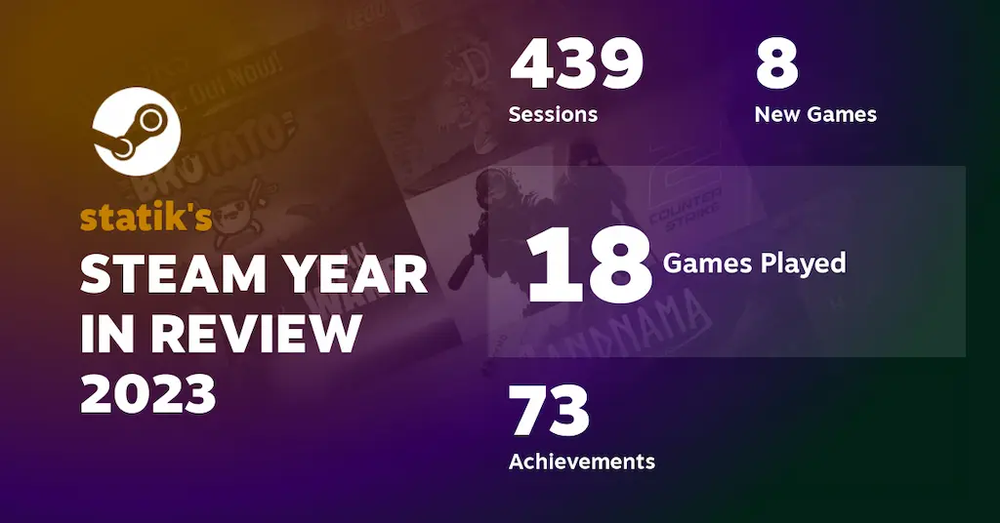

I decided this year to look back on the stuff I've read, watched, played, or listened to. While not everything I've consumed is listed here, I did want to point out some items that I enjoyed. No full reviews here, I prefer simple lists and quick thoughts. Gives me an excuse for another blog post at least.

## Books

See my full list of books in my [Books of 2023](/posts/books-of-2023) post.

### _I'm Glad My Mom Died_ by Jennette McCurdy

To be honest, I picked this up due to the immense popularity this book gained on release last year and wanted to see what all the fuss was. I was only on hold for the ebook at the library for five months, but it was worth it. I never watched _iCarly_ (didn't have cable growing up) so I didn't read this for the nostalgia, but rather the perspective a child actor had in show business. And boy, is it rough. I'm sure some child actors have great experiences but it really takes its toll on those kids. I was also raised Mormon, so I understood some of the experiences McCurdy had, and how it shaped her life and her mother's actions. Fantastic memoir, highly recommended.

### _How to Take Over the World_ by Ryan North

I follow Ryan North's [SMBC comic](https://www.smbc-comics.com/) but I didn't know he wrote books. This book was available at my library and I was on paternity leave so I figured I had some time to read it. I enjoy these types of non-fiction, humorous, science-y type books and North's work fit perfectly in that genre. Chances are I will **not** be taking over the world, but should the opportunity present itself, I'll be just a bit more prepared.

### _All the Sinners Bleed_ by S.A. Cosby

Some years ago, I stumbled across S.A. Cosby's book, _Blacktop Wasteland_, at the library (I judged the book by its cover). I read it and thoroughly enjoyed Cosby's writing. I've since read all his books (except _My Darkest Prayer_) and his latest, _All the Sinners Bleed_, was an enjoyable thriller. I liked the perspective Cosby provided via the characters, and trying to tackle current events. Looking forward to his next book.

Additionally, I've also started listening to audiobooks, thanks to self-hosting the [Audiobookshelf server](https://www.audiobookshelf.org/). The only books I've listened to so far are the _Harry Potter_ series. It started out as testing the deployment of the server, but I ended up just listening to them all. Ah nostalgia. Next up is the _The Lord of the Rings_ series.

## Music

Here are some artists/bands that I enjoyed listening to this year. You can see all my listening habits over on [last.fm](https://www.last.fm/user/spencer314).

### Metric

I've only listened to some of Metric's old stuff before this year, but their album _Art of Doubt_ popped up in the algorithm and I was hooked. I try to listen to all their albums regularly. Standout track for me is "Risk".

### The National

Don't judge me but the only reason I started listening to The National was due to their song "The Alcott" featuring Taylor Swift. That song has been on repeat a few times for me this year, but I've enjoyed the rest of the album, _First Two Pages of Frankenstein_ as well. The rest of their discography has started popping up in my rotations lately. Standout track is "The Alcott (feat. Taylor Swift)".

### Cage the Elephant

Similar to Metric, I've only heard the early songs of Cage the Elephant, but some of their newer albums popped up in my recommendations so I gave them a go. Their albums _Tell Me I'm Pretty_ and _Social Cues_ were a common occurrence in my music habits this year. Standout tracks are "Ready to Let Go" and "Social Cues".

### Future Islands

This was a new band I had never heard before. Something about the voice of the lead singer was rather unique and I enjoyed it. Played a few tracks here and there on repeat. Standout track is "A Dream of You and Me".

### Yiruma

At some point in passing, I heard the song "River Flows in You". I didn't know what it was, but thanks to my Pixel's Now Playing feature, I found this amazing piano player. I play the album _The Best - Reminiscent 10th Anniversary_, of which contains the above song, when I need some relaxing, modern classical music. Standout tracks are "River Flows in You" and "May Be".

### CHVRCHES

I've been on a bit of a kick trying to listen to more bands featuring female lead singers (thanks to listening to a lot of Metric). CHVRCHES was the one band that kept coming up and I've listened to many of their songs. I'm sold. Standout track is "How Not To Drown (feat. Robert Smith)".

### Broken Bells

And yet one more instance of re-picking up a band that I hadn't listened to in years. The albums _After the Disco_ and _INTO THE BLUE_ are great albums. Standout track is "Good Luck".

### Honorable Mention

I just wanted to share a song that I stumbled across on reddit of all places. It's "Can't Get You Out Of My Head (ft. Parcels)" by AnnenMayKantereit. It's a cover of the immortal song by Kylie Minogue, and dangit, _I can't get it out of my head_. My tracking isn't accurate because it's only available on YouTube, but it's probably in my top five played songs this year.

Click to open a YouTube embed of "Can't Get You Out of My Head (Cover)"

<iframe class="w-100 mx-auto" width="560" height="315" src="https://www.youtube-nocookie.com/embed/RacxNskxySo?rel=0&iv_load_policy=3" title="YouTube video player" frameborder="0" allow="accelerometer; autoplay; clipboard-write; encrypted-media; gyroscope; picture-in-picture; web-share" loading="lazy"></iframe>

## Podcasts

I need to find some new podcasts, but here's a couple I've listened to this year.

### _Darknet Diaries_

Currently, _Darknet Diaries_ is the only podcast that I have notifications set up to alert me about new episodes. There's some really fantastic stories being told, and has definitely made me more aware of my own cybersecurity and general Internet habits. I especially enjoyed the episodes about game console hacking and the people who created modchips, game hackers, and the one about the money counterfeiter (episode 102).

### _The Nateland Podcast_

A coworker mentioned that the comedian Nate Bargatze was one of the few "clean" comedians. I started listening to his podcast when I needed some light-hearted background chatter. I'd totally go to one of his shows, should he come back to Utah.

### _Search Engine_

One of my favorite podcasts of all time is _Reply All_, but due to some controversies, the podcast lost one of its hosts, PJ Vogt. Once that died down, he started _Search Engine_. While I don't know the full story of what happened, I missed _Reply All_. I'd say _Search Engine_ is adjacent to _Reply All_, covering similar stories. So for now it fills some of that void. I'll pick up new episodes when they sound interesting to me. I think I'll also go back to some of the _Reply All_ archives in the meantime...

## Movies

I need to track this section better. last.fm has been great for tracking music, but I think I want to check out one of those movie/TV tracking services. The following is from memory, and there's definitely more than what I've listed here.

### _Spider-Man: Across the Spider-Verse_

If you're like me and have Superhero Fatigue™, I get it. I don't watch much anything anymore in this genre, post-_Endgame_. But if there's one series of superhero movies to watch, it's the Spider-Man Spider-Verse movies. The first one was amazing, and this sequel is no different. _Across the Spider-Verse_ continues the story of Miles and totally delivers. If nothing else, watch it for the animation quality alone. In this time of AI-generated nonsense, it's refreshing to see some true homegrown art.

### _Oppenheimer_

In college, I read the book this movie is based on, _American Prometheus_. I was very excited to see this adaptation come to the big screen, and it did not disappoint. The performance of Oppenheimer by Cillian Murphy was on point. A very emotional and thought provoking movie. I'm glad I saw this one in theaters too.

### _Barbie_

_Barbie_ was one of my favorite movies this year. I did laugh many times, and the satire was perfect. Margot Robbie and Ryan Gosling (and everyone else) did a fantastic job. Remember, you are Kenough.

### _The Gray Man_

I have soft spot for spy-thriller movies, and apparently I enjoy a lot of movies starring Ryan Gosling. _The Gray Man_ was a solid entry in the thriller genre. The scenes with both Gosling and Chris Evans were fantastic.

### _Bullet Train_

The spy-thriller genre strikes again. The cast was amazing in this movie. I'm not usually a Brad Pitt fan (the _Ocean Eleven_ series notwithstanding) but he was the star of the show. Well, him and the duo of Aaron Taylor-Johnson and Brian Tyree Henry as Tangerine and Lemon. Will need to watch again.

## TV Shows

Next year I'm also going to try and track these better. I swear there was a show I really enjoyed this year, but I can't remember what it was...

### _Better Call Saul_, full series

I started watching _Better Call Saul_ a couple years ago after finishing _Breaking Bad_. It was only this year that I finished latter half of the show. An absolute hit, one of my favorite shows (along with _Breaking Bad_). I daresay I kinda liked _Better Call Saul_ over _Breaking Bad_, mostly due the amazing performances of Bob Odenkirk and Rhea Seehorn. 10/10, would watch again.

### _BLUE EYE SAMURAI_, season 1

This show was an unexpected favorite for me. I'm usually not into animated shows, but the first episode was posted to YouTube by Netflix, and it hooked me. The story was great, characters well-written and developed, and the animation was gorgeous (I think this was the clincher) and soundtrack perfect. You never know what shows Netflix will cancel after the first season, but it has been confirmed a second season is coming.

### _The Great British Baking Show_, collection 11

I look forward to the new season of _The Great British Baking Show_ every year, and this season was excellent as usual. I miss the duo of Noel and Matt, but the new host, Alison has kept up with the shenanigans pretty well.

### _Ahsoka_, season 1

I went into this show fairly blind. I've never watched the animated Star Wars shows (_Clone Wars_, _Rebels_), but I was faintly aware of who the character Ahsoka and her role in the greater Star Wars stories. _Ahsoka_ turned out pretty well (much better than _The Book of Boba Fett_), and I enjoyed it. Looking forward to season 2, need to find out what happens to Baylan Skoll (RIP Ray Stevenson) and Shin Hati...

### _Barbecue Showdown_, seasons 1 & 2

I'm pretty sure this show was created by BIG BARBECUE to try and convince me to buy a smoker. And it's working.

## Games

Haven't dedicated much time to gaming this year, with having a new kid and all, but here are some of the games I enjoyed playing. This list would probably be half this if it wasn't for getting a Steam Deck. Totally worth it.

### Tony Hawk's Pro Skater 1+2

I've been waiting for the day this was no longer an Epic exclusive (bleh) and it finally made its way to Steam this year. Fantastic remaster of the classic games, killer soundtrack, and runs fantastic on the Deck.

### Brotato

Out of the _Vampire Survivors_-inspired clones, this one is pretty simple and straightforward. Lots of fun! Though out of my six-ish hours of playing, I've only managed to get to get to level 20 once...

### Fallout 4

One of my favorite games of all time is _Fallout 3_, so decided to try and make progress in _Fallout 4_, especially now with a Deck (works great by the way). Certainly got further in the game, but so much to do, and I keep finding all the side quests. Despite that, I like _Fallout 4_, and one day I'll complete it.

### Slay the Spire

I've had this one for a couple years, but I picked it back up once I got my Deck. And I finally managed to beat the final boss, the Corrupted Heart. It was one of my most satisfying gaming moments. Been plugging away at the Ascensions (currently at Ascension 12) lately. Slowly, but surely. One of the best games I've played. Ironclad for life.

### Rocket League

I'm only including this because I love _Rocket League_ (1300+ hours), or at least I loved the game it once was. While the core gameplay is the same, the post-Epic acquisition has left it a shell of its former indie self. I used to buy keys and the Rocket Pass, but I haven't spent a dime on it since Psyonix was bought out. And ever since Psyonix/Epic announced they were removing player-to-player trading, I simply stopped playing. I may pick it back up one day, though I feel its days are numbered, either being absorbed into _Fortnite_ (bleh) or _Rocket League 2_. Well played! gg

For posterity, here's my Steam 2023 Year in Review

## Next Year

I don't really have anything I'm looking forward to. The only show I was waiting for was _Andor_, season 2, which was set to be released in August 2024, but as of today, it's been delayed. Probably to sometime in 2025. Maybe if _The Umbrella Academy_ releases its final season...
