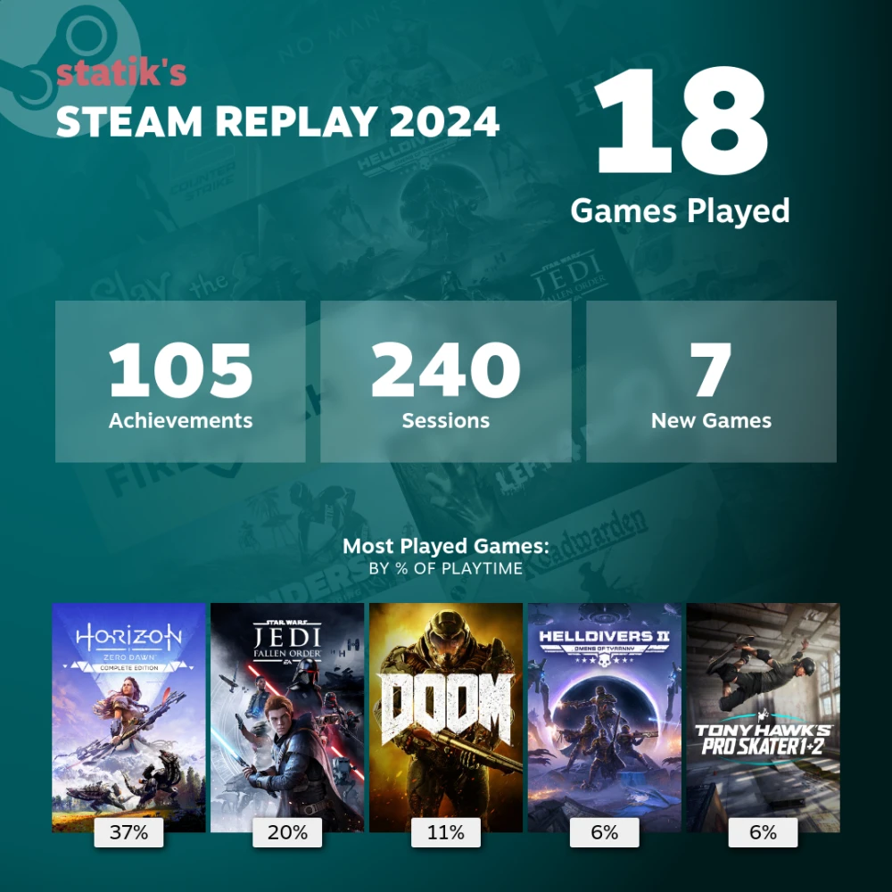

Much like last year, I wanted to give a quick review of some of the media I consumed this year. I'm not much of a reviewer, but I had several stand-out items I enjoyed, so thought I'd make a mention of it here. Simple and quick, that's all.

## Books

A small selection of the books I read this year. See my full list of books in my [Books of 2024](/posts/2024/books-of-2024) post.

### _The Hobbit_ and _The Lord of the Rings_ by J.R.R. Tolkien

This is not the first time I read these outstanding books, it's at least the third time I've done so. The difference this year, I got the audiobook editions, read by none other than Andy Serkis. Really enjoyable rendition of the books, Serkis does a fantastic job of giving the characters their own voice. Which isn't surprising, I've enjoyed his many acting roles. Highly recommend this audiobook edition for LOTR.

### _11/22/63_ and _Under the Dome_ by Stephen King

I'm really starting to enjoy King's novels, and these two were excellent. King dives into deep detail and keeps you guessing on what's happening next. I've read a few King novels up to this point, and I'm going to keep going though his bibliography. I really don't know how he keeps coming up with all these stories, but I'm all for it.

## Music

Here are some artists/bands that I enjoyed listening to this year. You can see all my listening habits over on [last.fm](https://www.last.fm/user/spencer314).

### Metric

Once again, Metric has topped my most played artist. It made it even more special this year as I was able to see them live when they came to Ogden. Fantastic live show, wish they were the headlining act, but fun nonetheless. Four of my top 10 tracks in 2024 were from Metric. Standout track is "Just the Once".

### Maggie Rogers

Can't remember how I came across Maggie Rogers, but she became one of my top artists this year. She had a new album this year, which must've been it. Standout track is "Don't Forget Me".

### CHVRCHES

Similar to last year, CHVRCHES came up again and again, thanks to all my listening of Metric. Not mad, they're great. Standout track this year is "Screen Violence".

### Alice Merton

I've listened to Alice Merton in the past, but it was really only the one song of hers ("Roots"). But there was plenty more songs just as good, if not better! Again, she started coming up thanks to my Metric listening. I too, recommend her. Standout track is "run away girl".

### Honorable Mentions

My wife was on a Chappell Roan kick for a good bit, which means I listened to plenty of her as well. I like her music, though the themes can be a bit much. Standout track is "Good Luck, Babe!"

Rounding out more of my female singers is Florence + the Machine and MisterWives. Standout tracks are "My Love" and "Wrongside", respectively.

I try to listen to some soundtracks more often, and one that I played several times is the Celeste soundtrack. Perfect electronic, synth-y/ambient music for me. And I haven't even played the game.^[Likely will never play it, not because it's a bad game but because I am not great at precision platformers. Don't have the reflexes anymore.]

Last to mention, I had two songs on repeat more times than I'd like to admit: "Too Sweet" by Hozier and "Panoramic View" by AWOLNATION. Sometimes a song just hits right and I enjoy it almost too much.

## Podcasts

So many podcasts, so little time. Here's a couple I enjoyed this past year.

### _Endless Thread_

I love podcasts about Internet culture and mysteries and occasionally current events. And _Endless Thread_ hits them all. The hosts are great and the topics are entertaining, sometimes bleak, but overall fun. I don't listen to all episodes, but I pick out some that interest me. Standout episode I enjoyed was "Where's the Beef?" (January 19).

### _Hyperfixed_

_Hyperfixed_ is a new show, hosted by Alex Goldman, one of the former hosts of _Reply All_. In _Reply All_, there were several episodes called "Super Tech Support", where the hosts would take listeners' questions or problems and try to solve them. _Hyperfixed_ has very similar premise, and not limited to techy questions. There was a great episode about the origins of a button found in a button museum, "Casey Wants to Believe" (December 4).

### _Proof_

The podcast from America's Test Kitchen, _Proof_ just talks about food and food-related topics. Lots of interesting topics, their goal is to entertain and teach, of which I've experienced both.

## Movies

The number of movies I've added to my watchlist compared to the actual number of movies I watched, is at least 2:1. But hey, got a few in, so here are some movies I watched:

### _Edge of Tomorrow_

Can't believe I waited this long to watch this movie. Love or hate Tom Cruise, I found this movie a lot of fun. Emily Blunt also did a great job. I didn't know it was based on a graphic novel, going to have to check it out.

### _Hit Man_

While the plot and movie were okay, the acting by Glen Powell really stole the show. Made the movie pretty fun as a result.

### _Wicked_

I'm not usually a musical-watching kind-of-guy, but this was a great movie. The songs are super catchy and the actors were phenomenal. I still can't picture the real-life Cynthia Erivo playing Elphaba. She played the part so well. So yeah, _Wicked_ is well-deserved of all the praise it has received.

## TV Shows

I didn't watch a lot of TV shows this year, my time was spent more playing games, but I managed to watch a few seasons here and there. Here's some of what I watched:

### _BEEF_, season 1

This was sort of a spur of the moment show, and I'm glad I watched it. I thought the characters were great, the story felt real, and it was fun, if a little depressing. I guess it's getting a second season?

### _Pluto_, full series

_Pluto_ is my first anime I've really ever watched (unless Pokemon and Yu-gi-oh count). I decided to watch this since it seemed relatively tame as far as anime shows go, and the story seemed interesting. It hasn't converted me to a full-time anime fan, but I am keeping an eye out for other shows.

### _Young Sheldon_, seasons 1-6

Admittedly, I became tired of _The Big Bang Theory_, back when it was on the air and I was in high school. I owned the DVDs of the first several seasons, but as it kept going on and on, I started to find the "nerd humor" a bit too cringe. And honestly, I'm not a fan of sitcoms with a laugh track.

Despite that, I heard good things about _Young Sheldon_ and since it became available on Netflix, I gave it a go. While it does have a lot of family sitcom tropes, I still enjoyed it, and I appreciated that the whole show didn't revolve around Sheldon's character. At the very least, it was a good background-type show.

### _Nobody Wants This_, season 1

I was not expecting to watch this, but Shona suggested we watch it, and boy was I glad I did. I haven't laughed at a show in a long time, and this had many such moments. The two main characters were perfectly casted, and their senses of humor were just right. I'm glad this is getting more seasons, I thoroughly enjoyed it.

### Honorable Mentions

_Detroiters_ was as show I randomly picked up, since I've heard that the main actor, Tim Robinson, is pretty funny with that absurd, deadpan type humor. I watched this and thought it was great, both main actors played very well together.

As always, my standby autumn into winter show, _The Great British Baking Show_, had another excellent season (collection 12), and some of the contestants were simply unexpected amazing bakers.

### Dishonorable Mentions

Unfortunately, not all shows I watched were great. I'm not going to name all the bad shows I watched, but I want to mention the final season of _The Umbrella Academy_, finally released this year. I was looking forward to it, but boy, was it bad. I can't quite put my finger on why, but it just felt so ridiculous and missing the charm of the first seasons. Seasons 1 & 2 were great, 3 was meh, 4 was downright bad. The only redemption was the casting of Nick Offerman and Megan Mullally in their roles, they always do a good job.

## Games

[New PC](/posts/2024/building-a-new-pc-in-2024/) means new games, or games new to me. I've been wanting to play a bunch of games for a long time but never had a computer powerful enough to run them decently. Until now.

Here's a few games I played this year:

### DOOM (2016)

I love the Doom games and this was, hands down, the best version I've played yet. Stellar graphics (for its time), nice gameplay and combat, and killer soundtrack.

### Firewatch

For a purely story-driven game, I enjoyed it. But what I think was the clincher for me, was despite it's relatively simple graphics, I thought it was beautiful. Wish I could play it again.

### STAR WARS Jedi: Fallen Order

I've been a, not a diehard, but an enjoyer of all things Star Wars. Some of my favorite video games growing up were Star Wars games (Rogue Squadron, Podracer, Jedi Outcast, Jedi Academy, Battlefront series), and I feel like Fallen Order is right up there with the best of them. Loved the game.

Only gripe was that playing this on Linux meant not using the EA launcher and thus I didn't get any of the achievements. Because EA sucks.

### _Horizon: Zero Dawn_

Saved the best for last. Hands-down, one of my favorite games ever. I went into this game blind, and boy, I was blown away. Not just the story and gameplay, but the visual graphics and the world that was created for this. Over the course of the 80-ish hours of my first playthrough, I was constantly stunned at how beautiful and detailed the game was. Aloy was also a fantastic protagonist, and the story was excellent. Sure, some of the quests were repetitive and not too interesting, but it never bored me. The DLC was also, in some ways, better than the main game. I would play this again, if I had the time to do so, and perhaps get those last two New Game+ achievements too.

My undisputed GOTY.

For posterity, here is my Steam 2024 Replay

## Next Year

For 2025, I'm making very little plans with regard to media I'm going to consume. As long as _Andor_, season 2 releases, I'll be happy.
