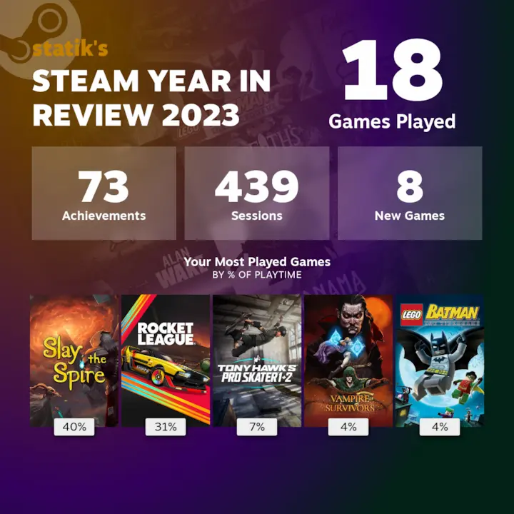

I decided this year to look back on the stuff I've read, watched, played, or listened to. While not everything I've consumed is listed here, I did want to point out some items that I enjoyed. No full reviews here, I prefer simple lists and quick thoughts. 

Gives me an excuse for another blog post at least.

## Books
See my full list of books in my [Books of 2023](/posts/books-of-2023) post.

### [I'm Glad My Mom Died](https://www.goodreads.com/book/show/59364173-i-m-glad-my-mom-died) by Jennette McCurdy
To be honest, I picked this up due to the immense popularity this book gained on release last year and wanted to see what all the fuss was. I was only on hold for the ebook at the library for five months, but it was worth it. I never watched *iCarly* (didn't have cable growing up) so I didn't read this for the nostalgia, but rather the perspective a child actor had in show business. And boy, is it rough. I'm sure some child actors have great experiences but it really takes its toll on those kids. I was also raised Mormon, so I understood some of the experinces McCurdy had, and how it shaped her life and her mother's actions. Fantastic memoir, highly recommended.

### [How to Take Over the World](https://www.goodreads.com/book/show/58446218-how-to-take-over-the-world) by Ryan North
I follow Ryan North's [SMBC comic](https://www.smbc-comics.com/) but I didn't know he wrote books. This book was available at my library and I was on paternity leave so I figured I had some time to read it. I enjoy these types of non-fiction, humorous, science-y type books and North's work fit perfectly in that genre. Chances are I will **not** be taking over the world, but should the opportunity present itself, I'll be just a bit more prepared.

### [All the Sinners Bleed](https://www.goodreads.com/book/show/61884832-all-the-sinners-bleed) by S.A. Cosby
Some years ago, I stumbled across S.A. Cosby's book, *Blacktop Wasteland*, at the library (I judged the book by its cover). I read it and thoroughly enjoyed Cosby's writing. I've since read all his books (except *My Darkest Prayer*) and his latest, *All the Sinners Bleed*, was an enjoyable thriller. I liked the perspective Cosby provided via the characters, and trying to tackle current events. Looking forward to his next book.

## Music
Here are some artists/bands that I enjoyed listening to this year. You can see all my listening habits over on [last.fm](https://www.last.fm/user/spencer314).

* Metric
* The National
* Cage the Elephant
* Future Islands
* Yiruma
* CHVRCHES
* Broken Bells

## Podcasts
### Darknet Diaries
Currently, *Darknet Diaries* is the only podcast that I have notifications set up to alert me about new episodes. There's some really fantastic stories being told, and has definitely made me more aware of my own cybersecurity and general Internet habits. I especially enjoyed the episodes about game console hacking and the people who created modchips, game hackers, and the one about the money counterfeiter (episode 102).

### The Nateland Podcast
A coworker mentioned that the comedian Nate Bargatze was one of the few "clean" comedians. I started listening to his podcast when I needed some light-hearted background chatter. I'd totally go to one of his shows, should he come back to Utah.

### Search Engine
One of my favortie podcasts of all time is *Reply All*, but due to some controversies, the podcast lost one of its hosts, PJ Vogt. Once that died down, he started *Search Engine*. While I don't know the full story of what happened, I missed *Reply All*. I'd say *Search Engine* is adjacent to *Reply All*, covering similar stories. So for now it fills some of that void. I'll pick up new episodes when they sound interesting to me. I think I'll also go back to some of the *Reply All* archives in the meantime... 

## Movies
I need to track this section better. last.fm has been great for tracking music, but I think I want to check out one of those movie/TV tracking services. The following is from memory, and there's definitely more than what I've listed here.

### Spider-Man: Across the Spider-Verse
### Oppenheimer
### Barbie
### The Gray Man

## TV Shows
Again, next year I'm going to try and track these better. I swear there was a show I really enjoyed but I can't remember what it was...

### Better Call Saul, full series
I started watching *Better Call Saul* a couple years ago after finishing *Breaking Bad*. It was only this year that I finished latter half of the show. An absolute hit, one of my favorite shows (along with *Breaking Bad*). I daresay I kinda liked *Better Call Saul* over *Breaking Bad*, mostly due the amazing performances of Bob Odenkirk and Rhea Seehorn. 10/10, would watch again.

### BLUE EYE SAMURAI, season 1
This show was an unexpected favorite for me. I'm usually not into animated shows, but the first episode was posted to YouTube by Netflix, and it hooked me. The story was great, characters well-written and developed, and the animation was gorgeous (I think this was the clincher) and sountrack perfect. You never know what shows Netflix will cancel after the first season, but it has been confirmed a second season is coming.

### The Great British Baking Show, collection 11
I look forward to the new season of *The Great British Baking Show* every year, and this season was excellent as usual. I miss the duo of Noel and Matt, but the new host, Alison has kept up with the shenanigans pretty well. 

### Ahsoka, season 1
I went into this show fairly blind. I've never watched the animated Star Wars shows (*Clone Wars*, *Rebels*), but I was faintly aware of who the character Ahsoka and her role in the greater Star Wars stories. *Ahsoka* turned out pretty well (much better than *The Book of Boba Fett*), and I enjoyed it. Looking forward to season 2, need to find out what happens to Baylan Skoll (RIP Ray Stevenson) and Shin Hati... 

### Barbecue Showdown, seasons 1 & 2
I'm pretty sure this show was created by BIG BARBECUE to try and convince me to buy a smoker. And it's working. 

## Games
Haven't dedicated much time to gaming this year, with having a new kid and all, but here are some of the games I enjoyed playing. This list would probably be half this if it wasn't for getting a Steam Deck. Totally worth it.

### Tony Hawk's Pro Skater 1+2
I've been waiting for the day this was no longer an Epic exclusive (bleh) and it finally made its way to Steam this year. Fantastic remaster of the classic games, killer soundtrack, and runs fantastic on the Deck.

### Brotato
Out of the *Vampire Survivors*-inspired clones, this one is pretty simple and straightforward. Lots of fun! Though out of my six-ish hours of playing, I've only managed to get to get to level 20 once...

### Fallout 4
One of my favorite games of all time is *Fallout 3*, so decided to try and make progress in *Fallout 4*, especially now with a Deck (works great by the way). Certainly got further in the game, but so much to do, and I keep finding all the side quests. Despite that, I like *Fallout 4*, and one day I'll complete it.

### Slay the Spire
I've had this one for a couple years, but I picked it back up once I got my Deck. And I finally managed to beat the final boss, the Corrupted Heart. It was one of my most satisfying gaming moments. Been plugging away at the Ascensions (currently at Ascension 12) lately. Slowly, but surely. One of the best games I've played. Ironclad for life.

### Rocket League
I'm only including this because I love *Rocket League* (1300+ hours), or at least I loved the game it once was. While the core gameplay is the same, the post-Epic acquistion has left it a shell of its former indie self. I used to buy keys and the Rocket Pass, but I haven't spent a dime on it since Psyonix was bought out. And ever since Psyonix/Epic announced they were removing player-to-player trading, I simply stopped playing. I may pick it back up one day, though I feel its days are numbered, either being absorbed into *Fortnite* (bleh) or *Rocket League 2*. Well played! gg

For posterity, here's my Steam 2023 Year in Review

